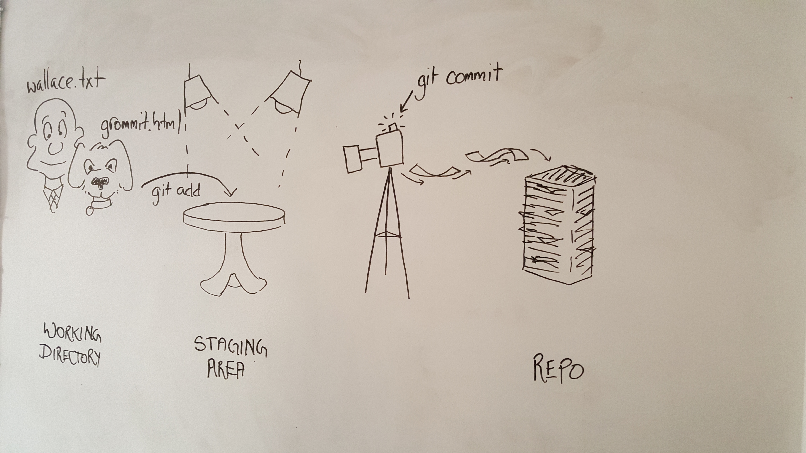
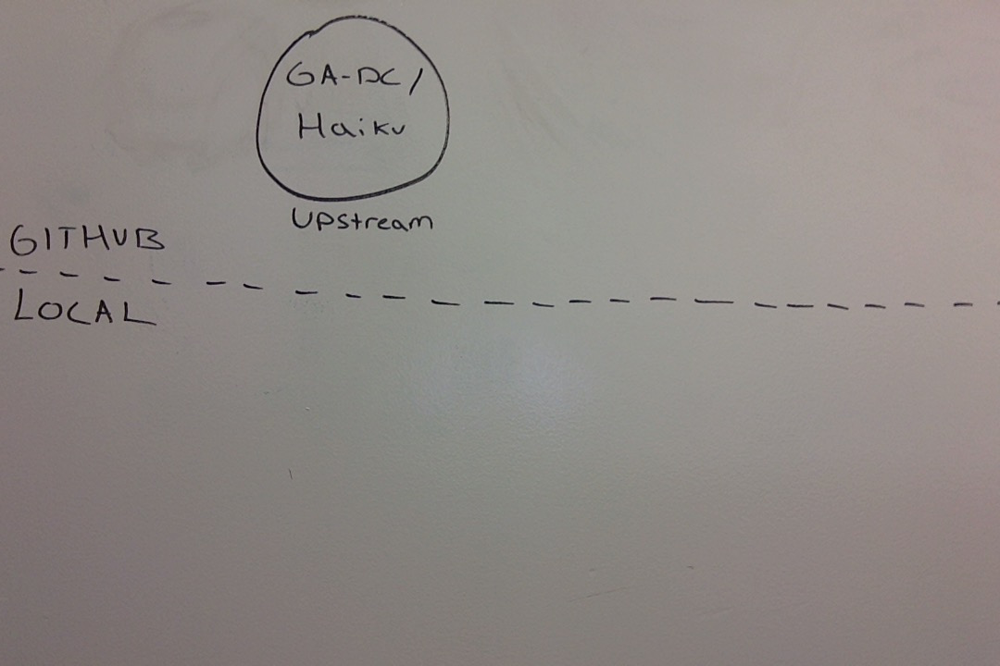
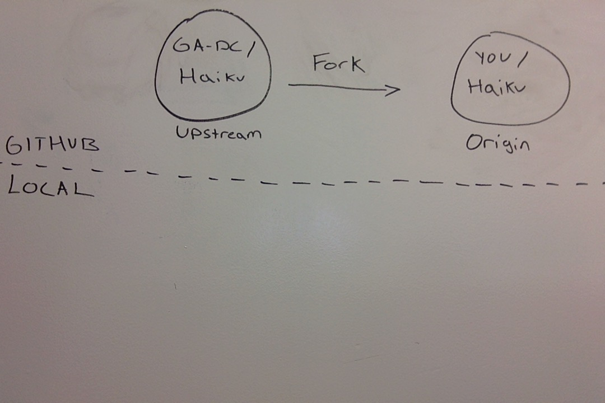
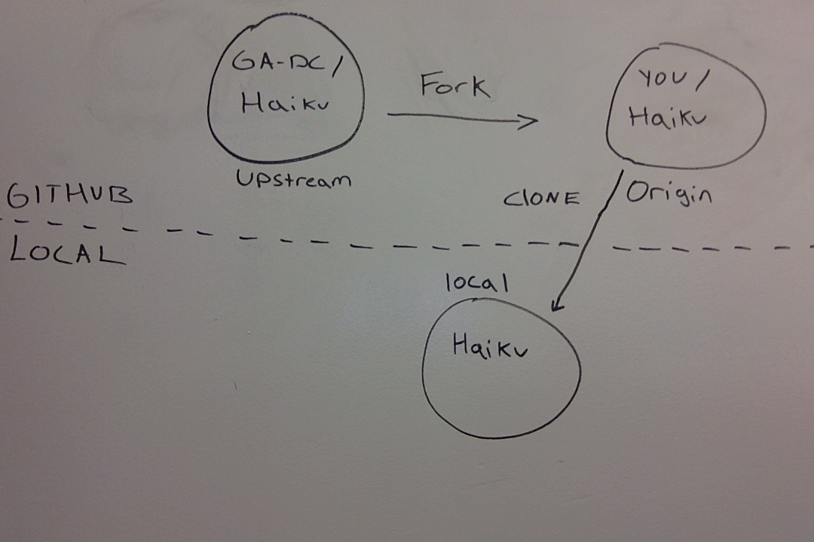
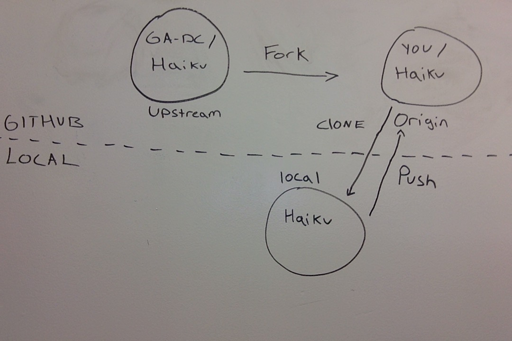
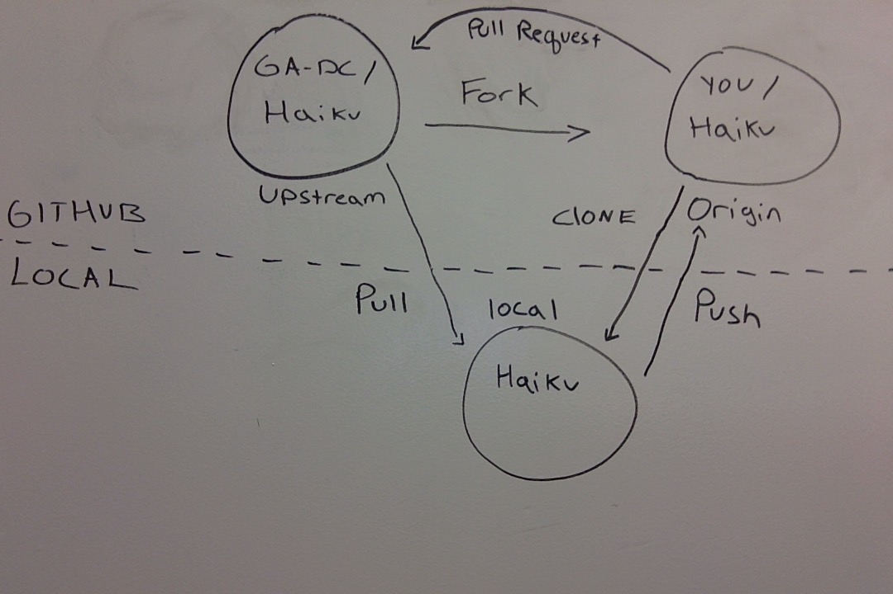
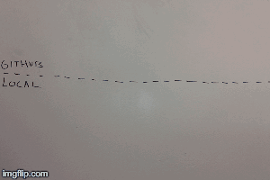

# Intro to Git

## Summary

This lesson aims to teach you both the fundamentals (both conceptual and
mechanical), of using git, as well as how to use git with Github to share
changes.

- Git is **awesome**
- Git is **hard**

## Learning Objectives

### Conceptual

- Explain what version control is and why developers use it
- Understand the components of a git repository
- Describe what a git remote repository is.
- Differentiate between git as a tool, and github as a service

### Mechanical
- Initialize a local git repository
- Add and commit changes to a git repository
- Add a remote repository, and push/pull changes to that remote
- Use the 'fork, clone, and pull request' model to submit assignments

## Framing

### The Purpose of Version Control

Think about how you've managed tracking changes to a file over time (perhaps
with other people).

#### THINK PAIR SHARE (10 Minutes)
Answer the following questions yourself, then turn to your neighbor and discuss your answers. We will then go around and compare.
- What does version control mean to you?
- When have you used a form of version control previously?
- What was frustrating about that experience?
- How did it work if you were collaborating with other people?


#### Explaining Git (10 Minutes)

**So what is Git, and why does it help us?**
Above all else, Git is a fast version control system, that allows you to efficiently handle projects large and small.

Here are some problems we face as developers, and how git solves them:

**Reverting to past versions**

Git allows us to make save points at any time. These save points are called
'commits'. Once a save point is made, it's permanent, and allows us to go back
to that save point at any time.
<!-- From there, we can see what the code looked like at that point, or even start building off that version. -->

**Keeping track of what each version 'meant'**

Every commit has a description (commit message), which allows us to describe
what changes were made between the current and previous commit. This is usually a description of what features
were added or what bugs were fixed.

Additionally, git supports tagging, which allows us to mark a specific commit
as a specific version of our code (e.g. '2.4.5').

**Comparing changes to past versions**

It's often important to see content of the actual changes that were made. This
can be useful when:
* tracking down when and how a bug was introduced
* understanding the changes a team member made so you can stay up-to-date with progress
* reviewing code as a team for correctness or quality/style

Git allows us to easily see these changes (called a `diff`) for any given commit.
<!--
**Collaborating / discussing changes**

In addition to just sharing changes, it is useful to have discussions on those
changes (again for code review). Git doesn't support this out of the box, but
Github does provide this feature. For example, you can add comments to a changed
line or lines in a given commit. -->

**Fearlessness in making changes**

In developing software, we often want to experiment in adding a feature or
refactoring (rewriting) existing code. Because git makes it easy to go back to a
known good state, we can experiment without worrying that we'll be unable to
undo the experimental work.

### Core Concepts of Git Repositories (40 minutes)

This section aims to introduce the core use of git, as well as the fundamental
concepts of how git works (and associated terms).


#### Terms and Concepts (Core Git)

* **working tree** - the folder (and it's files and sub-folders, that are in the repository)
* **repository** - collection of commits (save points of the working tree)
* **commit** - a snapshot of the working tree at a giving time (along with a message of what changed)
* **the index** - a staging area where we list changes we want to commit
* **HEAD** - what is currently checked out
* **status** - what files have changed, and what step are they in.

See diagram of the various components of a git repository, and how
they relate.



#### Git Local Workflow

Developing a project revolves around the basic **edit/stage/commit** pattern.

First, you edit your files in the working directory. When you’re ready to save a copy of the current state of the project, you stage changes with git add. After you’re happy with the staged snapshot, you commit it to the project history with git commit.

This means that git add needs to be called every time you alter a file.

The staging area is one of Git's more unique features, and it can take some time to wrap your head around it. It helps to think of it as a buffer between the working directory and the project history.

Instead of committing all of the changes you've made since the last commit, the stage lets you group related changes into highly focused snapshots before actually committing it to the project history. This means you can make all sorts of edits to unrelated files, then go back and split them up into logical commits by adding related changes to the stage and commit them piece-by-piece.

The git commit command commits the staged snapshot to the project history. Committed snapshots can be thought of as “safe” versions of a project—Git will never change them unless you explicitly ask it to. Along with git add, this is one of the most important Git commands.

### Break (10 minutes)

#### (WE DO) Exercise 1: Create a Repository and Committing Locally

1. create a new `resume` folder in sandbox directory.
2. initialize a git repository in the `resume` folder.
  - ```git init```
3. Create a resume.txt file and write anything in it.
4. make an initial commit with the current version of their code (all files) (remember to ```add``` and then ```commit```)

#### (You DO)
4. modify a file (e.g. resume.txt) and create a new commit, with an appropriate message
5. repeat previous step (committing) but this time, change two files.
6. view the 'history' by running `git log` to see the log of commits, and what changed

** Note: If you've initialized the git repository in your sandbox folder instead of the resume folder, try running ```rm -rf .git```**


### Remote Repositories and Github (30 minutes)

#### Docs Dive (5 minutes)

Students should briefly look over provided reading on [Git Remotes](https://git-scm.com/book/en/v2/Git-Basics-Working-with-Remotes)
and prepare to discuss key takeaways (read through pushing remotes).

#### Terms and Concepts (Remotes)

* **remote** - another repository that can be syncronized with a remote
* **github** - a service that hosts git remote repositories, and provides a web app to interact / collaborate on them
* **clone**  - download an entire remote repository, to be used as a local repository
* **fetch**  - downloading the set of changes (commits) from a remote repository
* **merge**  - taking two histories (commits),
* **pull**   - fetching changes and merging them into the current branch
* **push**   - sending changes to a remote repository and merging them into the specified branch
* **merge conflict** - when two commits conflict, and thus can't be merged automatically.

#### Creating your own remote repo

* Set up push capability from local to remote

#### Exercise 2: Publish to a remote repository on Github

1. make sure you are in the resume directory and you have nothing to commit.
2. ensure you have at least one commit
3. create a github repo
  - To create a repo, click on the '+' at the top right of your Github profile
4. give the repo a name and description, and ensure it's public
  - don't worry about the other selections
5. Follow the steps provided to add repo as a remote and push to remote
  - NOTE: there are 3 options for setting up your repo. take a second to think about which commands you need here
  - Is the repository on your LOCAL already existing?
6. open the repo on github, and explore the code there
7. make a change locally, commit it, and sync it
8. open the repo on github, and note that the changes have synced

### Break (10 minutes)

### Forking & Pull Requests (35 minutes)

#### Terms and Concepts (Forking and Pull Requests)

* **fork** - make a copy of a repo on github under a different account, used for OSS collaboration
* **pull request** - a github feature which allows a user to suggest and discuss changes to a repo they have forked

See diagram of the fork/clone/push/pull request process, and how it relates
to HW submission.







<!--  -->

<!-- #### Exercise 3: Fork, Clone and create a Pull Request
Visit the [haiku](https://github.com/ga-dc/haiku) repo and follow the instructions
there.
 -->

#### Exercise 3: Reset your work
What if you staged some work and realize you don't want that saved? Or, what if you've gone even further and committed something, but want tor evert back to the last commit?

1. make a few changes to your resume.txt file
2. stage those files, but do NOT commit
3. check your ```git status```
4. try reverting that file back to before it was staged, what happens when you run ```git status``` again?
  * ```git reset head```
5. make a new change to your resume.txt file, and this time ```add``` and ```commit``` it
6. can you still revert with the same command?
7. try ```git reset head^```
  * ***note, be VERY careful when reseting! you cannot undo if you go back a commit***


### Closing

- Why is version control important for developers?
- What problems do we anticipate using git / github?
- Differentiate between git as a tool, and github as a service
- Define and differentiate between forking and cloning

## Quiz Questions

1. What are the main components of a git repository and how do they relate?
2. Describe the steps of the process for contributing to open source software on
   Github (the same as our homework submission process).


## Homework

### 1. Visit the [haiku](https://github.com/ga-dc/haiku) repo and follow the instructions there.

In the comments of the Pull Request description, please include a block like so (numbers out of 5):

```
comfort_level: 4
completeness: 5
```


## Resources

* [Interactive Git Cheetsheet](http://ndpsoftware.com/git-cheatsheet.html)
* [Syncing with Git](https://www.atlassian.com/git/tutorials/syncing/)
* [Github Guides](https://guides.github.com)
* [Github Training](https://training.github.com/kit/)
* [Git Immersion - Interactive Course](http://gitimmersion.com/lab_05.html)
* [Pro Git](http://git-scm.com/book/en/v2) - An in-depth free PDF book for those wanting to understand git deeper
* [GitUp - Interactive Commit Visualizer](http://gitup.co)
* [Practice with Git](https://github.com/grayghostvisuals/practice-git)


## Appendix - Git CLI Commands

### Creating Repositories

* `git init` - run this command in a folder to turn it into a git repository
  * note: don't init a repo inside an existing repo! (also don't init in your home folder)
OR
* `git clone <URL>` - download (clone) a repo from github (or other remote source)

### Linking an existing repo to github

1. Create the repo on github.com (make sure not to check the 'initialize with readme').
2. Follow the instructions on the new repo's webpage to add as a remote:
3. Change directories to the local repo
  * `cd ~/path/to/repo`
4. Add the github remote, and name it 'origin':
  * `git remote add origin <URL>`
5. Push the existing commits up to the remote called 'origin' , and set it to track master branch:
  * `git push -u origin master`

Once linked, you can just run `git push` to push master branch to master branch

### Committing

1. Add the files you want to commit to the index (equivalent to checking which files you want to commit in the Github GUI app)
  * `git add file1 file2 ...`, or `git add .` will add all changes in the current folder
2. Create the commit:
  * `git commit -m "description message for commit"`
  * if you omit the `-m` and message, then git will open an editor for you to write the message in

### Syncing with a remote (push/pull)

1. `git pull [remote] [branch]` - fetch and merge changes (from the origin and branch specified) and merge them into the current branch.
  * If origin and branch aren't specified, git will default to the tracking branch (usually origin and the remote branch with the same name as the current branch).
  * If no origin/branch are specified, and no tracking branch is set up, git may tell you to specify
2. 'git push [remote] [branch]' - push and merge local changes from the current branch to the specified branch on the remote repo and branch specified.
  * Same rules apply as `git pull` above.


### Optional Bonus assignments:
* Create a blog site using jekyll (hosted using a separate repo at **your_github_username*.github.io/blog, this is called a 'project' rep)
* Register for a custom domain name (usually $6 - $10 a year), and associate it with your github project site

You'll find instructions that will help at the bottom of the [github pages guide](https://pages.github.com).**
